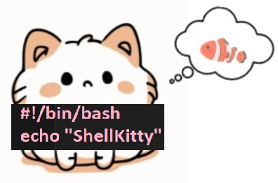

# ShellKitty

<br>


<br>
Project to automate applications and system tasks in Shell Script Bash, focused on agility, QA, testing and security. Systems: Linux, MacOS, Android, BSD, Cloud and Docker linux containers.
<br><br>

```bash
/\_/\
( o.o)
 > ^ < ........... HELLO TO SHELLKITTY ><)))º>

Options:
[0] Exit
[1] Menu
[2] Postgre
[3] Maven and Spark
[4] Docker

@ Developed by Rainbowcrack
```
