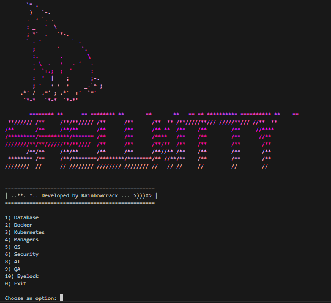

# ShellKitty


> **Automatize aplicações e tarefas de sistema com testes de segurança, em menos de 1 minuto!**  
> ShellKitty é um projeto em Shell Script (Bash) voltado para automação de ambientes Linux, MacOS, Android (via Termux), BSD, Cloud e Docker, com foco em **agilidade, qualidade, testes e segurança**.

---

## Propósito

Este projeto prepara o ambiente do sistema operacional com foco em **desenvolvimento web full-stack**, fornecendo ferramentas, dependências e testes automatizados para facilitar a vida do desenvolvedor iniciante.

Inspirado na disciplina **Trabalho Interdisciplinar II** da **PUC Minas**, do curso de Ciência da Computação, onde alunos são desafiados a criar uma aplicação funcional com:

- **Back-end:** Java, Maven, Spark e PostgreSQL  
- **Front-end:** Qualquer tecnologia ou framework  
- **Hospedagem:** Local (com suporte a Docker) ou em nuvem 

---

## Como usar
Clone meu repositório e dê o privilégio do arquivo principal para execução. Para isso, cole o seguinte código no terminal!!

```bash
mkdir shellframework
cd shellframework
git clone https://github.com/rainbowcrack/shellkitty.git
cd ShellKitty
chmod 777 menu.sh
./menu.sh
```

## Tela Inicial


@ Desenvolvido por **Rainbowcrack** - 2025